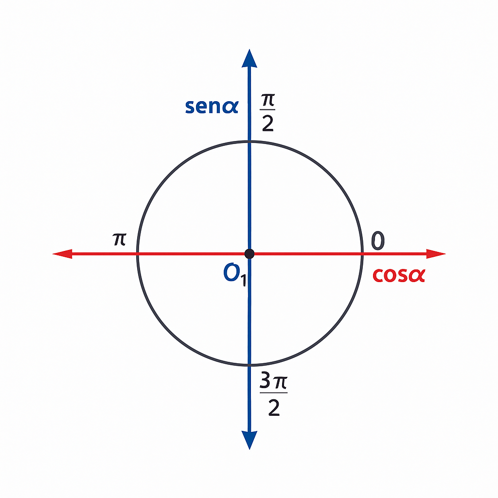
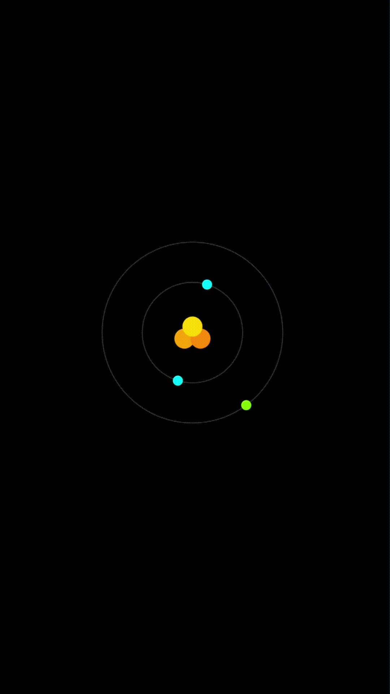

# Átomo de Lítio com React-native-Skia 🎨


## Descrição
Neste projeto, foi realizado a criação de um desenho de um átomo de lítio, com seus 3 elétrons e 3 prótons no núcleo atômico; todos com a biblioteca React-native-skia. Foi realizado também a animação das órbitas das camadas de valência com o React-native-reanimated.

## Como criar nosso Átomo de Lítio

1. Com a Versão do node v20.17.0 instalada vamos instalar as bibliotecas essenciais para o projeto:
   - `npm install @shopify/react-native-skia@1.11.2`
   - `npm install react-native-reanimated`

2. Adicione o plugin do Reanimated no Babel.config.js
   ```jsx
     module.exports = {
      presets: ['module:@react-native/babel-preset'],
      plugins: [
        'react-native-reanimated/plugin',
      ],
     };
    ```
3. Crie um diretório chamado 'src' e dentro dele o seu diretório do átomo.
    ```bash
    seu-projeto/
    ├─ src/
    │  ├─ atom/
    │  │  └─ index.tsx
    ├─ index.js
    ├─ package.json
   ```

4. Importe todas as funções/componentes necessários:
    ```jsx
     import React, { useEffect } from 'react';
    import { View, StyleSheet, Dimensions } from 'react-native';
    import { Canvas, Circle } from '@shopify/react-native-skia';
    import {
      useSharedValue,
      useDerivedValue,
      withRepeat,
      withTiming,
      Easing,
    } from 'react-native-reanimated';
    ```
 
5. Usaremos no decorrer do projeto, conceitos de trigonometria para realizar as animações dos elétrons em suas órbitas.
    - Não será necessário o estudo aprofundado em trigonometria, mas caso queira se aprofundar: https://brasilescola.uol.com.br/matematica/simetria-no-circulo-trigonometrico.htm
    - 

  ## Para mais detalhes acesse meu vídeo tutorial em:
   [Tutorial em vídeo Parte 01](https://www.youtube.com/watch?v=Ko15MtuEEzY) 
 
   [Tutorial em vídeo Parte 02](https://www.youtube.com/watch?v=qzEqB53eYyY)
 
## Prévia


# Instalação
## Passo 1
Clone o projeto
```bash
git clone https://github.com/paulogermanopg/RN_Atom_Skia.git
```
## Passo 2
Instale os pacotes necessários
```bash
#use node =>18

#usando o npm
npm install

#usando o yarn (recomendado)
yarn install
```

# Licença do MIT
Copyright (c) 2025 Paulo Germano

Permission is hereby granted, free of charge, to any person obtaining a copy
of this software and associated documentation files (the "Software"), to deal
in the Software without restriction, including without limitation the rights
to use, copy, modify, merge, publish, distribute, sublicense, and/or sell
copies of the Software, and to permit persons to whom the Software is
furnished to do so, subject to the following conditions:

The above copyright notice and this permission notice shall be included in all
copies or substantial portions of the Software.

THE SOFTWARE IS PROVIDED "AS IS", WITHOUT WARRANTY OF ANY KIND, EXPRESS OR
IMPLIED, INCLUDING BUT NOT LIMITED TO THE WARRANTIES OF MERCHANTABILITY,
FITNESS FOR A PARTICULAR PURPOSE AND NONINFRINGEMENT. IN NO EVENT SHALL THE
AUTHORS OR COPYRIGHT HOLDERS BE LIABLE FOR ANY CLAIM, DAMAGES OR OTHER
LIABILITY, WHETHER IN AN ACTION OF CONTRACT, TORT OR OTHERWISE, ARISING FROM,
OUT OF OR IN CONNECTION WITH THE SOFTWARE OR THE USE OR OTHER DEALINGS IN THE
SOFTWARE.
